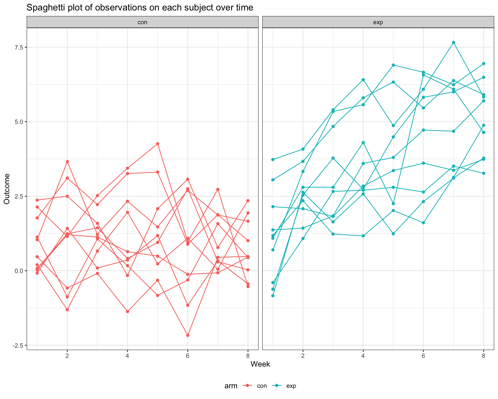

Homework 5
================
Lu Qiu
2023-11-02

### Problem 1

First, we import the dataset.

``` r
homicide_df = read_csv('data/homicide-data.csv') 
```

The raw data has 52179 observations and 12 variables and tells us about
homicides in 50 large U.S. cities.

Create a city_state variable (e.g. “Baltimore, MD”) and then summarize
within cities to obtain the total number of homicides and the number of
unsolved homicides (those for which the disposition is “Closed without
arrest” or “Open/No arrest”).

``` r
homicide_df = 
  homicide_df |>
  mutate(city_state = paste(city, state, sep = ', ')) |>
  group_by(city_state) |>
  summarise(
    total_homicides = n(),
    unsolved_homicides = sum(disposition %in% c("Closed without arrest", "Open/No arrest"))) 
```

For the city of Baltimore, MD, use the prop.test function to estimate
the proportion of homicides that are unsolved; save the output of
prop.test as an R object, apply the broom::tidy to this object and pull
the estimated proportion and confidence intervals from the resulting
tidy dataframe.

``` r
prop_test_result =
  homicide_df |>
  filter(city_state == "Baltimore, MD") |>
  with(prop.test(unsolved_homicides, total_homicides)) |>
  tidy()
```

The estimated proportion is 0.646. The 95% confidence interval is (
0.628 , 0.663 )

Now run prop.test for each of the cities in the dataset, and extract
both the proportion of unsolved homicides and the confidence interval
for each. Do this within a “tidy” pipeline, making use of purrr::map,
purrr::map2, list columns and unnest as necessary to create a tidy
dataframe with estimated proportions and CIs for each city.

``` r
calculate_proportions <- function(city) {
  prop_test_result =
    homicide_df |>
    filter(city_state == city) |>
    with(prop.test(unsolved_homicides, total_homicides)) |>
    tidy()
  
  return(prop_test_result)
}

# calculate_proportions('Baltimore, MD')
test_result_df =
  homicide_df |>
  mutate(estimate_df = map(city_state, calculate_proportions)) |>
  unnest(estimate_df) |>
  select(city_state, estimate, conf.low, conf.high)
```

Create a plot that shows the estimates and CIs for each city – check out
geom_errorbar for a way to add error bars based on the upper and lower
limits. Organize cities according to the proportion of unsolved
homicides.

``` r
test_result_df |>
  arrange(estimate) |>
  ggplot(aes(x = estimate, y = city_state)) +
  geom_point() +
  geom_errorbar(
    aes(xmin = conf.low, xmax = conf.high), width = 0.2) +
  labs(
    x = "Proportion of Unsolved Homicides",
    y = "City",
    title = "Estimates and Confidence Intervals for Unsolved Homicides by City"
  )
```


### Problem 2

Create a tidy dataframe containing data from all participants, including
the subject ID, arm, and observations over time:

- Start with a dataframe containing all file names; the list.files
  function will help
- Iterate over file names and read in data for each subject using
  purrr::map and saving the result as a new variable in the dataframe
- Tidy the result; manipulate file names to include control arm and
  subject ID, make sure weekly observations are “tidy”, and do any other
  tidying that’s necessary

``` r
full_df = 
  tibble(
    files = list.files("data/problem2/"),
    path = str_c("data/problem2/", files)
  ) |>
  mutate(data = map(path, read_csv)) |>
  unnest()
```

``` r
tidy_df = 
  full_df |>
  mutate(
    files = str_replace(files, ".csv", ""),
    arm = str_sub(files, 1, 3)) |>
  pivot_longer(
    week_1:week_8,
    names_to = "week",
    values_to = "outcome",
    names_prefix = "week_") |>
  mutate(week = as.numeric(week)) |>
  select(arm, subject_id = files, week, outcome)
```

Make a spaghetti plot showing observations on each subject over time,
and comment on differences between groups.

``` r
tidy_df |>
  ggplot(aes(x = week, y = outcome, group = subject_id, color = arm)) + 
  geom_point() + 
  geom_path() + 
  labs(title = "Spaghetti plot of observations on each subject over time",
       x = "Week",
       y = "Outcome") +
  facet_grid(~arm) 
```



### Problem 3

When designing an experiment or analysis, a common question is whether
it is likely that a true effect will be detected – put differently,
whether a false null hypothesis will be rejected. The probability that a
false null hypothesis is rejected is referred to as power, and it
depends on several factors, including: the sample size; the effect size;
and the error variance. In this problem, you will conduct a simulation
to explore power in a one-sample t-test.

First set the following design elements:

- Fix n = 30
- Fix σ = 5
